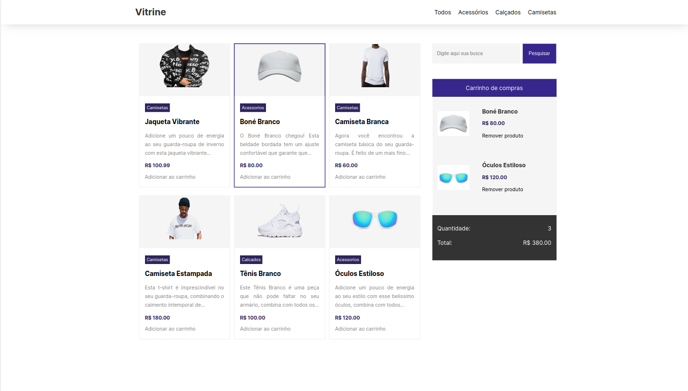

# Vitrine Virtual

## Descrição do Projeto

Este projeto é uma vitrine virtual criada utilizando apenas HTML, JavaScript e CSS, sem o uso de qualquer biblioteca. A vitrine possui funcionalidades como adicionar e remover produtos ao carrinho, filtrar produtos de acordo com a pesquisa e filtrar por categoria.

## Funcionalidades

1. **Adicionar e remover produtos ao carrinho**: Os usuários podem adicionar e remover produtos ao carrinho de compras.
2. **Filtragem de Produtos**: Os usuários podem pesquisar produtos usando palavras-chave. Além disso, os produtos podem ser filtrados por categorias.

## Tecnologias Utilizadas

- HTML
- CSS
  - Variáveis CSS
- JavaScript
  - Manipulação de DOM

## Como Executar o Projeto

1. Clone o repositório para o seu computador.
2. Abra o arquivo `main.html` no seu navegador.

## Imagem da Vitrine

## Contribuições

Contribuições são sempre bem-vindas. Sinta-se à vontade para abrir uma issue ou fazer um pull request.

